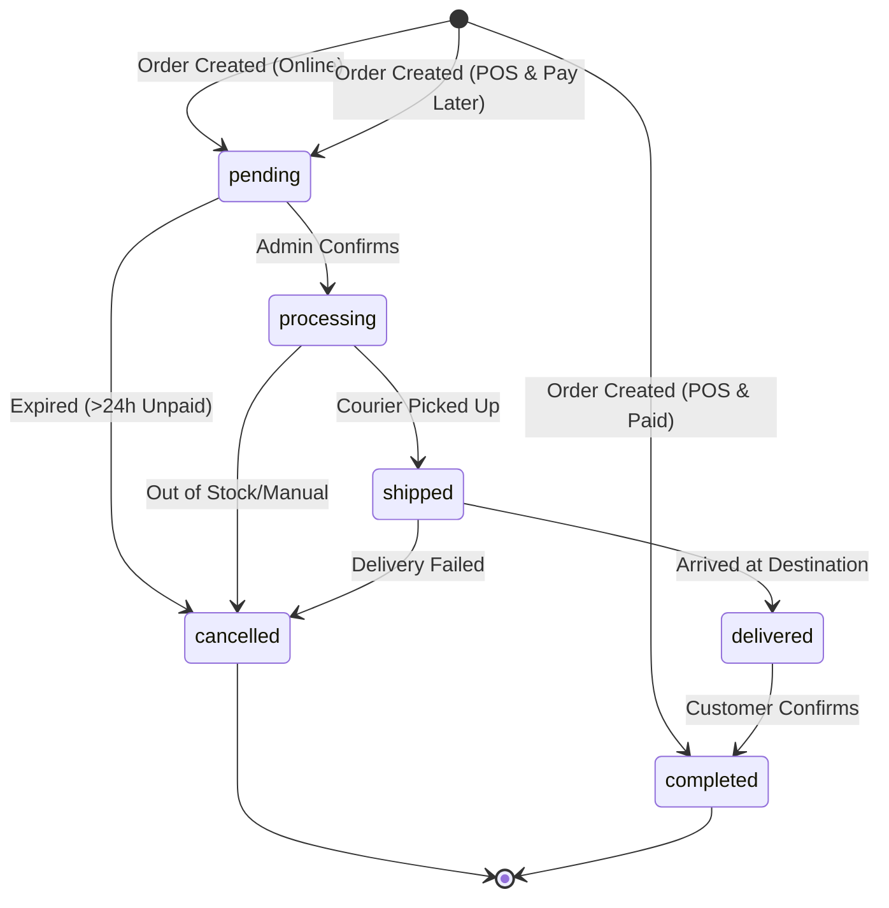
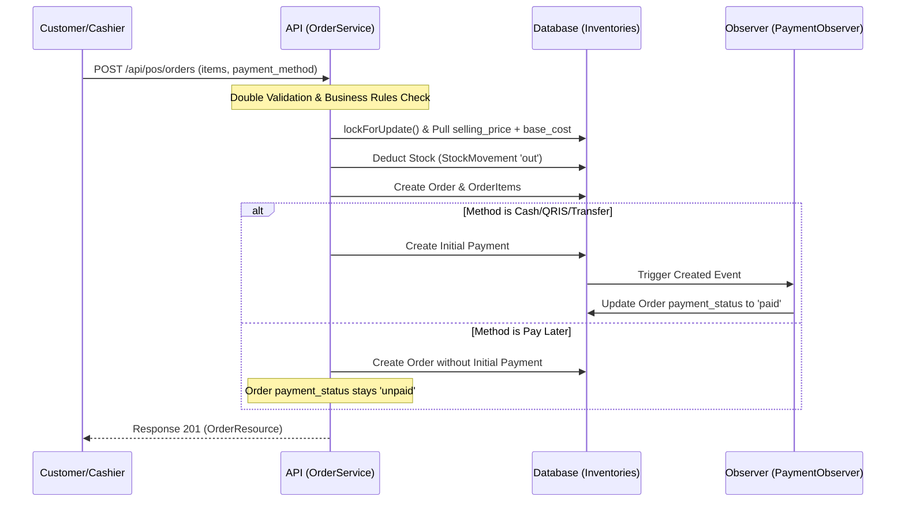
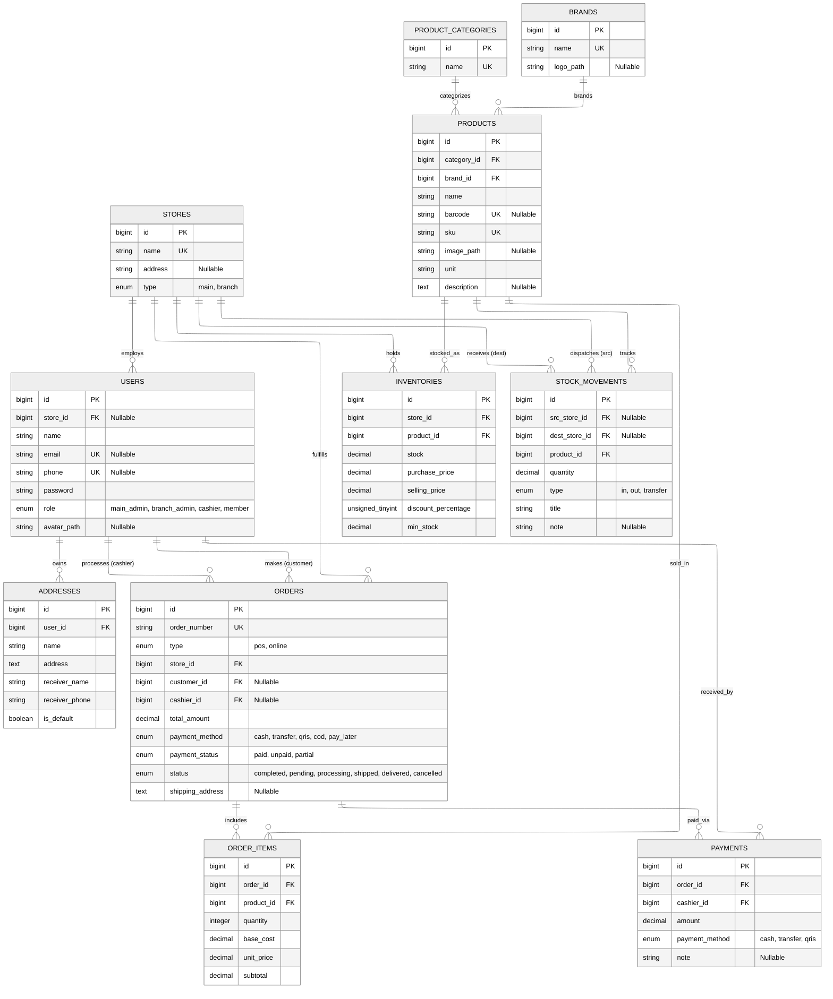

# PASPOS API

Backend API untuk aplikasi Paspos berbasis Laravel 12.

Project ini berfokus pada autentikasi nomor telepon dengan OTP WhatsApp, manajemen profil pengguna, serta otorisasi token API menggunakan Laravel Sanctum.

## Fitur Utama

1. Registrasi user dengan OTP WhatsApp (otomatis menjadi Member).
2. Verifikasi OTP untuk aktivasi akun.
3. Login Admin wajib menggunakan email.
4. Login Member bisa menggunakan nomor telepon atau email + password.
5. Forgot password dan reset password via OTP WhatsApp untuk member.
6. Forgot password dan reset password via OTP Email untuk admin.
7. Endpoint profil user terautentikasi (`/api/me`).
8. Update profil (`full_name` dan avatar).
9. Update password user.
10. Update nomor telepon dengan flow OTP WhatsApp terpisah.
11. Update email dengan flow OTP Email terpisah.
12. Role user (`main_admin`, `branch_admin`, `cashier`, `member`) dan relasi ke store.
13. Command artisan untuk membuat user admin.
14. CRUD Store berbasis role (khusus `main_admin`).
15. CRUD User berbasis role (`main_admin` vs `branch_admin`).
16. CRUD Product Category berbasis role (`main_admin`, `branch_admin`).
17. CRUD Brand berbasis role, dengan upload logo.
18. CRUD Product berbasis role, dengan upload image, filter by category/brand.
19. CRUD Inventory berbasis role, dengan filter store/product dan low stock alert.
20. CRUD Stock Movement berbasis role, dengan auto-update inventory via `StockMovementService`.
21. Manajemen Pemesanan (POS & Online) dengan tracking stok otomatis.
22. Sistem Pembayaran & Piutang (Pay Later) untuk member.
23. Tracking COGS (Harga Pokok Penjualan) historis pada setiap transaksi.
24. Pembatalan otomatis pesanan online yang kadaluarsa (>24 jam).
25. Public catalog browsing per cabang untuk guest/member.
26. Manajemen Keranjang Belanja (Cart) untuk Member.
27. Checkout Online terintegrasi dengan reservasi stok otomatis.
28. Manajemen Pengiriman & Status Pesanan Online untuk Admin (Shipping & Order Status).
29. Penyelesaian COD (Complete COD) dengan validasi idempotensi.
30. Pembersihan otomatis keranjang belanja yang ditinggalkan (Abandoned Cart Cleaner).

## Stack

- PHP >= 8.2 (direkomendasikan 8.4)
- Laravel 12
- MySQL
- Laravel Sanctum
- Queue database driver
- Pest untuk testing
- Vite + Tailwind CSS 4 (aset frontend bawaan Laravel)

## Struktur Proyek (Ringkas)

```text
app/
  Http/
    Controllers/
      Api/
        AuthController.php
        StoreController.php
        UserController.php
        ProductCategoryController.php
        BrandController.php
        ProductController.php
        InventoryController.php
        StockMovementController.php
      Member/
        AddressController.php
    Requests/
    Resources/
  Jobs/SendWhatsappOtpJob.php
  Models/
    User.php
    Store.php
    ProductCategory.php
    Brand.php
    Product.php
    Inventory.php
    StockMovement.php
  Services/
    WhatsappBotClient.php
    StockMovementService.php
  Support/PhoneNumberNormalizer.php
database/
  migrations/
  factories/
  seeders/
routes/
  api.php
  member.php
  web.php
tests/
  Feature/
    AuthOtpTest.php
    CreateAdminUserCommandTest.php
    StoreResourceApiTest.php
    UserResourceApiTest.php
    ProductCategoryApiTest.php
    BrandApiTest.php
    ProductApiTest.php
    InventoryApiTest.php
    StockMovementApiTest.php
bruno/
  paspos/
    member-branches/
    member-catalog/
    member-cart/
```

## Setup Lokal

### 1) Prasyarat

- PHP + Composer
- MySQL
- Node.js + npm
- Service WhatsApp Bot (untuk pengiriman OTP nyata)

### 2) Install dependency

```bash
composer install
npm install
```

### 3) Buat file environment

PowerShell (Windows):

```powershell
Copy-Item .env.example .env
```

Lalu generate app key:

```bash
php artisan key:generate
```

### 4) Konfigurasi database di `.env`

```env
DB_CONNECTION=mysql
DB_HOST=127.0.0.1
DB_PORT=3306
DB_DATABASE=paspos_api
DB_USERNAME=root
DB_PASSWORD=

QUEUE_CONNECTION=database
```

### 5) Migrasi dan seeding

```bash
php artisan migrate --seed
```

### 6) Link storage untuk avatar

```bash
php artisan storage:link
```

### 7) Jalankan aplikasi

Cara cepat (server + queue listener + vite):

```bash
composer run dev
```

Atau manual di terminal terpisah:

```bash
php artisan serve
php artisan queue:listen --tries=1
npm run dev
```

Health check endpoint:

```text
GET /up
```

## Environment Penting

Variabel `.env` yang paling penting:

- `APP_URL`
- `DB_*`
- `QUEUE_CONNECTION`
- `WHATSAPP_BOT_URL`
- `BOT_API_KEY`
- `WHATSAPP_BOT_TIMEOUT`
- `OTP_EXPIRES_IN_MINUTES`
- `OTP_RATE_LIMIT_MAX_ATTEMPTS`
- `OTP_RATE_LIMIT_DECAY_SECONDS`

## Integrasi WhatsApp Bot

OTP dikirim oleh job `SendWhatsappOtpJob` yang memanggil service `WhatsappBotClient`.

Request ke bot:

- Method: `POST`
- URL: `${WHATSAPP_BOT_URL}/send-message`
- Header opsional: `x-api-key: ${BOT_API_KEY}`
- Body JSON:

```json
{
  "number": "628xxxx",
  "message": "Kode OTP ..."
}
```

Pastikan queue worker berjalan agar OTP terkirim.

## Alur Auth OTP

1. `POST /api/register` membuat user baru (role selalu `member`) dan mengirim OTP registrasi.
2. `POST /api/verify-otp` memverifikasi OTP registrasi lalu memberikan token Sanctum.
3. `POST /api/login` menyesuaikan rule:
   - Admin (`main_admin`, `branch_admin`, `cashier`) wajib login menggunakan email.
   - Member boleh login dengan email (jika sudah verify) atau nomor telepon (jika sudah verify).
4. `POST /api/forgot-password` dan `POST /api/reset-password` untuk reset password member via OTP WhatsApp.
5. `POST /api/admin/forgot-password` dan `POST /api/admin/reset-password` untuk reset password admin via OTP Email.
6. `POST /api/me/phone/request-otp` dan `POST /api/me/phone/verify-otp` untuk update nomor telepon.
6. `POST /api/me/email/request-otp` dan `POST /api/me/email/verify-otp` untuk update email.

Catatan normalisasi nomor:

- Input seperti `0812-3456-7890` akan dinormalisasi menjadi `6281234567890`.

## Endpoint API

Semua endpoint API menggunakan prefix `/api`.

### Public

| Method | Endpoint | Keterangan |
| --- | --- | --- |
| POST | `/api/register` | Register user + kirim OTP |
| POST | `/api/resend-otp` | Kirim ulang OTP registrasi |
| POST | `/api/verify-otp` | Verifikasi OTP registrasi |
| POST | `/api/login` | Login |
| POST | `/api/forgot-password` | Kirim OTP reset password (member via WhatsApp) |
| POST | `/api/reset-password` | Reset password dengan OTP (member) |
| POST | `/api/admin/forgot-password` | Kirim OTP reset password (admin via Email) |
| POST | `/api/admin/reset-password` | Reset password dengan OTP (admin) |

### Protected (`auth:sanctum`)

| Method | Endpoint | Keterangan |
| --- | --- | --- |
| POST | `/api/logout` | Logout token saat ini |
| GET | `/api/me` | Ambil profil user login |
| GET | `/api/user` | Alias endpoint profil |
| PATCH | `/api/me` | Update `full_name` dan/atau avatar |
| PUT | `/api/me/password` | Update password |
| POST | `/api/me/phone/request-otp` | Request OTP nomor baru |
| POST | `/api/me/phone/verify-otp` | Verifikasi OTP nomor baru |
| POST | `/api/me/email/request-otp` | Request OTP email baru |
| POST | `/api/me/email/verify-otp` | Verifikasi OTP email baru |

### Protected Admin Resource (`auth:sanctum`)

#### Store Resource (khusus `main_admin`)

| Method | Endpoint | Keterangan |
| --- | --- | --- |
| GET | `/api/stores` | List store |
| POST | `/api/stores` | Create store |
| GET | `/api/stores/{store}` | Detail store |
| PATCH | `/api/stores/{store}` | Update store |
| DELETE | `/api/stores/{store}` | Hapus store |

#### User Resource

| Method | Endpoint | Keterangan |
| --- | --- | --- |
| GET | `/api/users` | List user |
| POST | `/api/users` | Create user |
| GET | `/api/users/{user}` | Detail user |
| PATCH | `/api/users/{user}` | Update user |
| DELETE | `/api/users/{user}` | Hapus user |

#### Product Category Resource (`main_admin`, `branch_admin`)

| Method | Endpoint | Keterangan |
| --- | --- | --- |
| GET | `/api/product-categories` | List kategori (search by name) |
| POST | `/api/product-categories` | Create kategori |
| GET | `/api/product-categories/{id}` | Detail kategori |
| PATCH | `/api/product-categories/{id}` | Update kategori |
| DELETE | `/api/product-categories/{id}` | Hapus kategori |

#### Brand Resource (`main_admin`, `branch_admin`)

| Method | Endpoint | Keterangan |
| --- | --- | --- |
| GET | `/api/brands` | List brand (search by name) |
| POST | `/api/brands` | Create brand (multipart, logo upload) |
| GET | `/api/brands/{id}` | Detail brand |
| PATCH | `/api/brands/{id}` | Update brand |
| DELETE | `/api/brands/{id}` | Hapus brand (+ hapus file logo) |

#### Product Resource (`main_admin`, `branch_admin`)

| Method | Endpoint | Keterangan |
| --- | --- | --- |
| GET | `/api/products` | List produk (search, filter category/brand) |
| POST | `/api/products` | Create produk (multipart, image upload) |
| GET | `/api/products/{id}` | Detail produk |
| PATCH | `/api/products/{id}` | Update produk |
| DELETE | `/api/products/{id}` | Hapus produk (+ hapus file image) |

#### Inventory Resource (`main_admin`, `branch_admin`)

| Method | Endpoint | Keterangan |
| --- | --- | --- |
| GET | `/api/inventories` | List inventory (filter store/product, low_stock) |
| POST | `/api/inventories` | Create inventory |
| GET | `/api/inventories/{id}` | Detail inventory |
| PATCH | `/api/inventories/{id}` | Update inventory |
| DELETE | `/api/inventories/{id}` | Hapus inventory |

#### Stock Movement Resource (`main_admin`, `branch_admin`)

| Method | Endpoint | Keterangan |
| --- | --- | --- |
| GET | `/api/stock-movements` | List movement (filter src/dest/product/type) |
| POST | `/api/stock-movements` | Create movement (auto-update inventory) |
| GET | `/api/stock-movements/{id}` | Detail movement |
| PATCH | `/api/stock-movements/{id}` | Update movement (hanya title/note) |
| DELETE | `/api/stock-movements/{id}` | Hapus movement (reverse inventory) |

#### Order & POS Resource (`main_admin`, `branch_admin`, `cashier`)

| Method | Endpoint | Keterangan |
| --- | --- | --- |
| GET | `/api/pos/products` | Cari produk untuk POS (barcode/name/brand) |
| POST | `/api/pos/orders` | Buat pesanan POS (Cash/Pay Later) |
| GET | `/api/orders` | List semua pesanan (filter store/payment_status) |
| GET | `/api/orders/{id}` | Detail pesanan + items |
| PATCH | `/api/orders/{order}/shipping` | Update biaya ongkir & kurir (Online Order) |
| PATCH | `/api/orders/{order}/status` | Update status pesanan (Online Order) |
| POST | `/api/orders/{order}/complete-cod` | Selesaikan pembayaran COD |

#### Payment Resource (`main_admin`, `branch_admin`, `cashier`)

| Method | Endpoint | Keterangan |
| --- | --- | --- |
| GET | `/api/payments` | List history pembayaran (filter order_id) |
| POST | `/api/payments` | Catat pembayaran baru (auto-update payment_status) |

### Public Member Catalog

| Method | Endpoint | Keterangan |
| --- | --- | --- |
| GET | `/api/member/branches` | List cabang untuk dipilih user |
| GET | `/api/member/{branch}/catalog/products` | List produk publik per cabang |
| GET | `/api/member/{branch}/catalog/products/{product}` | Detail produk publik |
| GET | `/api/member/{branch}/catalog/categories` | List kategori publik per cabang |
| GET | `/api/member/{branch}/catalog/brands` | List brand publik per cabang |

### Protected Member Resource (`auth:sanctum`)

#### Address Resource

| Method | Endpoint | Keterangan |
| --- | --- | --- |
| GET | `/api/member/addresses` | List address milik member |
| POST | `/api/member/addresses` | Create address baru |
| GET | `/api/member/addresses/{address}` | Detail address |
| PATCH/PUT | `/api/member/addresses/{address}` | Update address |
| DELETE | `/api/member/addresses/{address}` | Hapus address |

#### Cart Resource
| Method | Endpoint | Keterangan |
| --- | --- | --- |
| GET | `/api/member/{branch}/cart` | Lihat isi keranjang belanja |
| POST | `/api/member/{branch}/cart` | Tambah/update item ke keranjang |
| DELETE | `/api/member/{branch}/cart/{cartItem}` | Hapus item dari keranjang |
| POST | `/api/member/{branch}/cart/checkout` | Proses checkout menjadi pesanan |

## Aturan Otorisasi Role

### Store CRUD

- Hanya `main_admin` yang boleh akses Store resource (`index`, `store`, `show`, `update`, `destroy`).
- Role lain (`branch_admin`, `cashier`, `member`) akan mendapat response `403`.

### User CRUD

- `main_admin`: boleh mengelola semua user dan semua role.
- `branch_admin`: hanya boleh mengelola user dengan role `cashier` dan `member`.
- `branch_admin`: hanya boleh mengelola user pada store yang sama.
- `cashier` dan `member`: tidak memiliki akses ke resource user.

### Product Category, Brand, Product, Inventory, Stock Movement CRUD

- `main_admin` dan `branch_admin` boleh mengakses semua resource ini.
- `cashier` dan `member` mendapat response `403`.
- Inventory: tidak boleh duplikat pasangan `store_id` + `product_id`.

**Stock Movement Strict Constraints:**
- Semua pergerakan harus berupa **integer > 0**.
- Menggunakan Pessimistic Locking (`lockForUpdate`) untuk memastikan tidak ada race condition saat memutakhirkan kuantitas inventaris.
- Semua pembaruan Inventory dilakukan di dalam `DB::transaction()`.
- Kasus Bisnis:
  - **INBOUND (`in`)**: `dest_store_id` wajib ada, `src_store_id` wajib NULL. Menambah stok di gudang tujuan.
  - **OUTBOUND (`out`)**: `src_store_id` wajib ada, `dest_store_id` wajib NULL. Mengurangi stok dari gudang asal.
  - **TRANSFER (`transfer`)**: `src_store_id` dan `dest_store_id` wajib ada dan tidak boleh sama. Mengurangi stok asal, menambah stok tujuan.
  - **ADJUSTMENT**: Dilakukan dengan menggunakan tipe `in` (untuk koreksi positif) atau `out` (untuk koreksi negatif) beserta note.
- Jika terdapat stok tidak cukup saat `out` atau `transfer`, sistem akan mengembalikan response HTTP 422 (Unprocessable Entity) lewat `InsufficientStockException`.
- Update Stock Movement: hanya field `title` dan `note` yang bisa diubah (field stok terkunci, pergerakan append-only/immutable).
- Delete Stock Movement: akan me-reverse efek yang diberikan pada Inventory dan menghapus record movement.

### Address & Cart CRUD

- Katalog publik bisa diakses tanpa autentikasi melalui `/api/member/{branch}/catalog/*`.
- Hanya `member` yang bisa mengakses resource private ini (`/api/member/addresses` dan `/api/member/{branch}/cart`).
- Setiap member hanya dapat mengelola data miliknya sendiri.

### Order & Payment Authorization (Granular)

- **Listing & Detail**:
  - `main_admin`: Boleh melihat semua pesanan dari semua toko.
  - `branch_admin` & `cashier`: Hanya boleh melihat pesanan yang berasal dari toko tempat mereka ditugaskan (`store_id` sama).
- **Order Management (Shipping, Status, Complete COD)**:
  - `main_admin`: Boleh mengelola semua pesanan.
  - `branch_admin`: Hanya boleh mengelola pesanan dari toko mereka sendiri.
  - `cashier`: Tidak memiliki akses untuk mengubah biaya kirim, status pesanan, atau menyelesaikan COD manual.

Aturan tambahan saat create/update user oleh `main_admin`:

- Jika role `branch_admin`, `store_id` wajib diisi dan harus store bertipe `branch`.
- Jika role `main_admin` dan `store_id` diisi, store harus bertipe `main`.

## Validasi Payload Ringkas

- Register: `full_name`, `phone`, `password`, `password_confirmation`
- Login: `phone` ATAU `email`, dan `password`
- Verify OTP: `phone`, `otp` (6 digit)
- Reset Password: `phone`, `otp`, `password`, `password_confirmation`
- Reset Password Admin: `email`, `otp`, `password`, `password_confirmation`
- Update Profile: minimal salah satu dari `full_name` atau `avatar`
- Update Password: `current_password`, `new_password`, `new_password_confirmation`
- Update Phone: `new_phone`, dan `otp` pada step verifikasi
- Update Email: `new_email`, dan `otp` pada step verifikasi
- Store Create: `name`, `type` (`main` / `branch`), `address` (opsional)
- Store Update: `name`/`type`/`address` (minimal salah satu)
- User Create: `full_name`, `password`, `password_confirmation`, `role`, `email` (opsional), `phone` (opsional), `store_id` (opsional, tergantung aturan role)
- User Update: field user bersifat parsial (`full_name`, `email`, `phone`, `password`, `role`, `store_id`)
- Address Create/Update: `name`, `address`, `receiver_name`, `receiver_phone`, `is_default` (boolean), `notes` (opsional)
- Product Category Create: `name` (required, unique, max 32)
- Brand Create: `name` (required, unique, max 64), `logo` (opsional, image file)
- Product Create: `category_id`, `brand_id`, `name`, `sku` (unique), `unit`, `barcode` (opsional), `image` (opsional), `description` (opsional)
- Inventory Create: `store_id`, `product_id`, `purchase_price`, `selling_price`, `stock` (opsional), `discount_percentage` (opsional), `min_stock` (opsional)
- Stock Movement Create: `src_store_id` (opsional), `dest_store_id` (opsional), `product_id`, `quantity` (integer, gt:0), `type` (`in`/`out`/`transfer`), `title`, `note` (opsional)

## Alur Pemesanan & Pembayaran

### 1. POS (Point of Sale)
POS dirancang untuk transaksi langsung di toko.
- **Pencarian**: Mendukung scan barcode atau pencarian manual (nama/brand).
- **Harga**: Backend menarik harga terbaru dari tabel `inventories` (mengabaikan input harga dari frontend).
- **Metode**: `cash`, `transfer`, `qris`, atau `pay_later`.
- **Pay Later**: Hanya diperbolehkan jika `customer_id` disertakan (wajib Member).

### 2. Online Order
- Stok langsung di-reserve saat order dibuat.
- Jika tidak dibayar dalam 24 jam, sistem akan menjalankan job `orders:cancel-expired` untuk membatalkan order dan mengembalikan stok.

### 3. Status Keuangan (Payment Status)
Status pembayaran dikelola secara otomatis oleh `PaymentObserver`:
- `unpaid`: Belum ada pembayaran.
- `partial`: Total bayar < total tagihan.
- `paid`: Total bayar >= total tagihan.

### 4. Status Logistik & Transaksi (Order Status)
Berikut adalah visualisasi transisi status pesanan dari awal hingga selesai:



### Diagram Alur Transaksi



## Fitur Keamanan & Integritas

- **Double Validation**: Validasi skema di FormRequest dan validasi aturan bisnis di Service.
- **Anti-Fraud**: Backend selalu melakukan *price pull* dari database, bukan dari request body.
- **COGS tracking**: Mencatat `base_cost` (harga beli) pada setiap transaksi agar laporan laba-rugi akurat meskipun harga modal di masa depan berubah.
- **Concurrency**: Menggunakan Database Transactions dan Pessimistic Locking untuk mencegah *overselling*.

## Entity Relationship Diagram (ERD)

Berikut adalah struktur basis data lengkap untuk PASPOS API:



## Data Model Ringkas

### users

Kolom penting:

- `name`
- `email` (nullable, unique)
- `phone` (nullable, unique)
- `phone_verified_at`
- `avatar_path`
- `password`
- `role` (`main_admin`, `branch_admin`, `cashier`, `member`)
- `store_id` (nullable, relasi ke `stores`)

### stores

Kolom penting:

- `name` (unique)
- `address` (nullable)
- `type` (`main` atau `branch`)

### addresses

Kolom penting:

- `user_id` (relasi ke `users`)
- `name` (contoh: "Rumah", "Kantor")
- `address` (alamat lengkap)
- `receiver_name`
- `receiver_phone`
- `is_default` (boolean)

### product_categories

Kolom penting:

- `name` (unique, max 32)

### brands

Kolom penting:

- `name` (unique, max 64)
- `logo_path` (nullable)

### products

Kolom penting:

- `category_id` (FK ke `product_categories`)
- `brand_id` (FK ke `brands`)
- `name`
- `barcode` (nullable, unique)
- `sku` (unique)
- `image_path` (nullable)
- `unit`
- `description` (nullable)

### inventories

Kolom penting:

- `store_id` (FK ke `stores`)
- `product_id` (FK ke `products`)
- `stock` (decimal, default 0)
- `purchase_price` (decimal)
- `selling_price` (decimal)
- `discount_percentage` (tinyint, default 0)
- `min_stock` (decimal, default 0)

### stock_movements

Kolom penting:

- `src_store_id` (FK ke `stores`)
- `dest_store_id` (FK ke `stores`)
- `product_id` (FK ke `products`)
- `quantity` (decimal)
- `type` (`in` / `out`)
- `title`
- `note` (nullable)

### phone_verification_tokens

Kolom penting:

- `phone`
- `purpose` (`registration`, `password_reset`, `phone_update`)
- `token` (hashed)
- `expires_at`

### email_verification_tokens

Kolom penting:

- `email`
- `purpose` (`email_update`)
- `token` (hashed)
- `expires_at`

## Seeder Data Awal

`DatabaseSeeder` memanggil:

- `StoreSeeder`
- `UserSeeder`
- `ProductCategorySeeder`
- `BrandSeeder`
- `ProductSeeder`
- `InventorySeeder`

`UserSeeder` membuat contoh role:

- main admin
- branch admin
- cashier
- member

Catatan:

- Password default user hasil factory adalah `password`.
- Nomor telepon pada seed user bisa berubah tiap seed (generated by factory).

## Command Artisan Kustom

### Membuat User Admin

```bash
php artisan user:create-admin {role} [--name=] [--email=] [--phone=] [--password=] [--store_id=]
```

`role` hanya boleh:

- `main_admin`
- `branch_admin`

Aturan store:

- `branch_admin` wajib menyertakan `--store_id`.
- Jika `store_id` diisi pada `main_admin`, store harus bertipe `main`.
- Jika `store_id` diisi pada `branch_admin`, store harus bertipe `branch`.

Contoh:

```bash
php artisan user:create-admin main_admin --name="Main Admin" --email="main.admin@example.com" --phone="081234567890" --password="password123" --store_id=1
php artisan user:create-admin branch_admin --name="Branch Admin" --email="branch.admin@example.com" --phone="081355566677" --password="password123" --store_id=2
```

## Testing

Jalankan seluruh test:

```bash
php artisan test --compact
```

Jalankan test spesifik:

```bash
php artisan test --compact tests/Feature/AuthOtpTest.php
php artisan test --compact tests/Feature/CreateAdminUserCommandTest.php
php artisan test --compact tests/Feature/StoreResourceApiTest.php
php artisan test --compact tests/Feature/UserResourceApiTest.php
php artisan test --compact tests/Feature/ProductCategoryApiTest.php
php artisan test --compact tests/Feature/BrandApiTest.php
php artisan test --compact tests/Feature/ProductApiTest.php
php artisan test --compact tests/Feature/InventoryApiTest.php
php artisan test --compact tests/Feature/StockMovementApiTest.php
```

## Koleksi Bruno

Collection request API tersedia di:

```text
bruno/paspos
```

Struktur collection:

```text
bruno/paspos/
  auth/                -> Register, Resend OTP, Verify OTP, Login, Forgot/Reset Password
  profile/             -> Get Me, Update Profile, Update Avatar, Update Password
  phone-update/        -> Request/Verify Phone Update OTP
  email-update/        -> Request/Verify Email Update OTP
  admin-stores/        -> List/Create/Get/Update/Delete Store
  admin-users/         -> List/Create/Get/Update/Delete User
  product-categories/  -> List/Create/Get/Update/Delete Product Category
  brands/              -> List/Create/Get/Update/Delete Brand
  products/            -> List/Create/Get/Update/Delete Product
  inventories/         -> List/Create/Get/Update/Delete Inventory
  stock-movements/     -> List/Create/Get/Update/Delete Stock Movement
  member-branches/     -> List Branch untuk pemilihan cabang (public)
  member-catalog/      -> List Products/Detail Categories/Brands per cabang (public)
  member-cart/         -> Get/Add/Remove/Checkout Cart per cabang (private)
  member-addresses/    -> List/Create/Get/Update/Delete Address
  environments/        -> File environment Bruno
```

Sebelum dipakai, sesuaikan environment:

```text
bruno/paspos/environments/local.bru
```

Variabel yang biasanya diubah:

- `baseUrl`
- `phone`
- `newPhone`
- `password`
- `authToken`
- `storeId`
- `branchId`
- `targetUserId`
- `userRole`

## Troubleshooting

1. OTP tidak terkirim.
Pastikan WhatsApp Bot aktif, konfigurasi URL benar, dan queue worker berjalan.

2. Avatar URL tidak muncul.
Pastikan sudah menjalankan `php artisan storage:link`.

3. Kena rate limit OTP (`429`).
Sesuaikan `OTP_RATE_LIMIT_MAX_ATTEMPTS` dan `OTP_RATE_LIMIT_DECAY_SECONDS`.

## Lisensi

Project ini menggunakan lisensi MIT.
