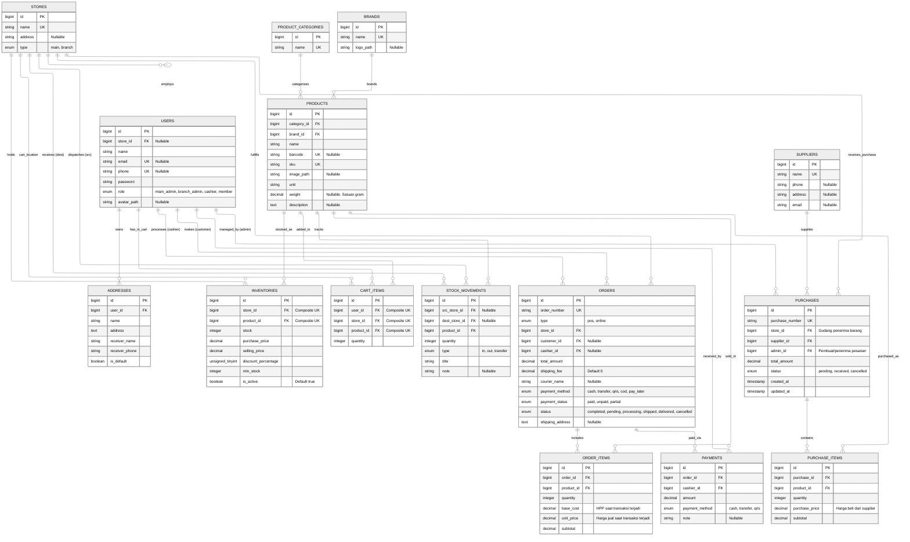

```mermaid
---
config:
  layout: elk
  theme: neutral
---
erDiagram
    STORES {
        bigint id PK
        string name UK
        string address "Nullable"
        enum type "main, branch"
    }

    USERS {
        bigint id PK
        bigint store_id FK "Nullable"
        string name
        string email UK "Nullable"
        string phone UK "Nullable"
        string password
        enum role "main_admin, branch_admin, cashier, member"
        string avatar_path "Nullable"
    }

    ADDRESSES {
        bigint id PK
        bigint user_id FK
        string name
        text address
        string receiver_name
        string receiver_phone
        boolean is_default
    }

    PRODUCT_CATEGORIES {
        bigint id PK
        string name UK
    }

    BRANDS {
        bigint id PK
        string name UK
        string logo_path "Nullable"
    }

    PRODUCTS {
        bigint id PK
        bigint category_id FK
        bigint brand_id FK
        string name
        string barcode UK "Nullable"
        string sku UK
        string image_path "Nullable"
        string unit
        decimal weight "Nullable. Satuan gram"
        text description "Nullable"
    }

    INVENTORIES {
        bigint id PK
        bigint store_id FK "Composite UK"
        bigint product_id FK "Composite UK"
        integer stock
        decimal purchase_price
        decimal selling_price
        unsigned_tinyint discount_percentage
        integer min_stock
        boolean is_active "Default true"
    }

    CART_ITEMS {
        bigint id PK
        bigint user_id FK "Composite UK"
        bigint store_id FK "Composite UK"
        bigint product_id FK "Composite UK"
        integer quantity
    }

    STOCK_MOVEMENTS {
        bigint id PK
        bigint src_store_id FK "Nullable"
        bigint dest_store_id FK "Nullable"
        bigint product_id FK
        integer quantity
        enum type "in, out, transfer"
        string title
        string note "Nullable"
    }

    ORDERS {
        bigint id PK
        string order_number UK
        enum type "pos, online"
        bigint store_id FK
        bigint customer_id FK "Nullable"
        bigint cashier_id FK "Nullable"
        decimal total_amount
        decimal shipping_fee "Default 0"
        string courier_name "Nullable"
        enum payment_method "cash, transfer, qris, cod, pay_later"
        enum payment_status "paid, unpaid, partial"
        enum status "completed, pending, processing, shipped, delivered, cancelled"
        text shipping_address "Nullable"
    }

    ORDER_ITEMS {
        bigint id PK
        bigint order_id FK
        bigint product_id FK
        integer quantity
        decimal base_cost "HPP saat transaksi terjadi"
        decimal unit_price "Harga jual saat transaksi terjadi"
        decimal subtotal
    }

    PAYMENTS {
        bigint id PK
        bigint order_id FK
        bigint cashier_id FK
        decimal amount
        enum payment_method "cash, transfer, qris"
        string note "Nullable"
    }

    SUPPLIERS {
        bigint id PK
        string name UK
        string phone "Nullable"
        string address "Nullable"
        string email "Nullable"
    }

    PURCHASES {
        bigint id PK
        string purchase_number UK
        bigint store_id FK "Gudang penerima barang"
        bigint supplier_id FK
        bigint admin_id FK "Pembuat/penerima pesanan"
        decimal total_amount
        enum status "pending, received, cancelled"
        timestamp created_at
        timestamp updated_at
    }

    PURCHASE_ITEMS {
        bigint id PK
        bigint purchase_id FK
        bigint product_id FK
        integer quantity
        decimal purchase_price "Harga beli dari supplier"
        decimal subtotal
    }

    %% Relationships - Identity & Master
    STORES ||--o{ USERS : "employs"
    USERS ||--o{ ADDRESSES : "owns"
    PRODUCT_CATEGORIES ||--o{ PRODUCTS : "categorizes"
    BRANDS ||--o{ PRODUCTS : "brands"
    
    %% Relationships - E-commerce & Logistik
    USERS ||--o{ CART_ITEMS : "has_in_cart"
    STORES ||--o{ CART_ITEMS : "cart_location"
    PRODUCTS ||--o{ CART_ITEMS : "added_to"
    
    STORES ||--o{ INVENTORIES : "holds"
    PRODUCTS ||--o{ INVENTORIES : "stocked_as"
    STORES ||--o{ STOCK_MOVEMENTS : "dispatches (src)"
    STORES ||--o{ STOCK_MOVEMENTS : "receives (dest)"
    PRODUCTS ||--o{ STOCK_MOVEMENTS : "tracks"
    
    %% Relationships - Sales
    STORES ||--o{ ORDERS : "fulfills"
    USERS ||--o{ ORDERS : "makes (customer)"
    USERS ||--o{ ORDERS : "processes (cashier)"
    ORDERS ||--o{ ORDER_ITEMS : "includes"
    PRODUCTS ||--o{ ORDER_ITEMS : "sold_in"
    ORDERS ||--o{ PAYMENTS : "paid_via"
    USERS ||--o{ PAYMENTS : "received_by"

    %% Relationships - Purchasing (Inbound)
    STORES ||--o{ PURCHASES : "receives_purchase"
    SUPPLIERS ||--o{ PURCHASES : "supplies"
    USERS ||--o{ PURCHASES : "managed_by (admin)"
    PURCHASES ||--o{ PURCHASE_ITEMS : "contains"
    PRODUCTS ||--o{ PURCHASE_ITEMS : "purchased_as"
```