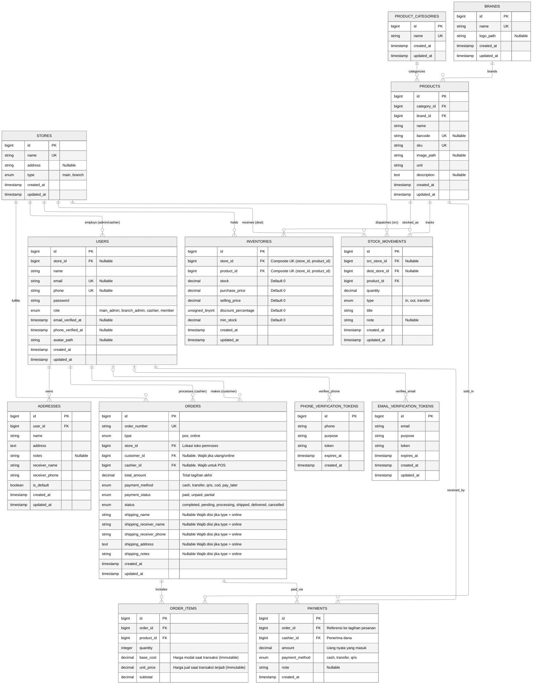

```mermaid
---
config:
  layout: elk
  theme: neutral
---
erDiagram
    STORES {
        bigint id PK
        string name UK
        string address "Nullable"
        enum type "main, branch"
        timestamp created_at
        timestamp updated_at
    }

    USERS {
        bigint id PK
        bigint store_id FK "Nullable"
        string name
        string email UK "Nullable"
        string phone UK "Nullable"
        string password
        enum role "main_admin, branch_admin, cashier, member"
        timestamp email_verified_at "Nullable"
        timestamp phone_verified_at "Nullable"
        string avatar_path "Nullable"
        timestamp created_at
        timestamp updated_at
    }

    ADDRESSES {
        bigint id PK
        bigint user_id FK
        string name
        text address
        string notes "Nullable"
        string receiver_name
        string receiver_phone
        boolean is_default
        timestamp created_at
        timestamp updated_at
    }

    PRODUCT_CATEGORIES {
        bigint id PK
        string name UK
        timestamp created_at
        timestamp updated_at
    }

    BRANDS {
        bigint id PK
        string name UK
        string logo_path "Nullable"
        timestamp created_at
        timestamp updated_at
    }

    PRODUCTS {
        bigint id PK
        bigint category_id FK
        bigint brand_id FK
        string name
        string barcode UK "Nullable"
        string sku UK
        string image_path "Nullable"
        string unit
        text description "Nullable"
        timestamp created_at
        timestamp updated_at
    }

    INVENTORIES {
        bigint id PK
        bigint store_id FK "Composite UK (store_id, product_id)"
        bigint product_id FK "Composite UK (store_id, product_id)"
        decimal stock "Default 0"
        decimal purchase_price "Default 0"
        decimal selling_price "Default 0"
        unsigned_tinyint discount_percentage "Default 0"
        decimal min_stock "Default 0"
        timestamp created_at
        timestamp updated_at
    }

    STOCK_MOVEMENTS {
        bigint id PK
        bigint src_store_id FK "Nullable"
        bigint dest_store_id FK "Nullable"
        bigint product_id FK
        decimal quantity
        enum type "in, out, transfer"
        string title
        string note "Nullable"
        timestamp created_at
        timestamp updated_at
    }

    ORDERS {
        bigint id PK
        string order_number UK
        enum type "pos, online"
        bigint store_id FK "Lokasi toko pemroses"
        bigint customer_id FK "Nullable. Wajib jika utang/online"
        bigint cashier_id FK "Nullable. Wajib untuk POS"
        decimal total_amount "Total tagihan akhir"
        enum payment_method "cash, transfer, qris, cod, pay_later"
        enum payment_status "paid, unpaid, partial"
        enum status "completed, pending, processing, shipped, delivered, cancelled"
        string shipping_name "Nullable Wajib diisi jika type = online"
        string shipping_receiver_name "Nullable Wajib diisi jika type = online"
        string shipping_receiver_phone "Nullable Wajib diisi jika type = online"
        text shipping_address "Nullable Wajib diisi jika type = online"
        string shipping_notes "Nullable Wajib diisi jika type = online"
        timestamp created_at
        timestamp updated_at
    }

    ORDER_ITEMS {
        bigint id PK
        bigint order_id FK
        bigint product_id FK
        integer quantity
        decimal base_cost "Harga modal saat transaksi (Immutable)"
        decimal unit_price "Harga jual saat transaksi terjadi (Immutable)"
        decimal subtotal
    }

    PAYMENTS {
        bigint id PK
        bigint order_id FK "Referensi ke tagihan pesanan"
        bigint cashier_id FK "Penerima dana"
        decimal amount "Uang nyata yang masuk"
        enum payment_method "cash, transfer, qris"
        string note "Nullable"
        timestamp created_at
    }

    PHONE_VERIFICATION_TOKENS {
        bigint id PK
        string phone
        string purpose
        string token
        timestamp expires_at
        timestamp created_at
    }

    EMAIL_VERIFICATION_TOKENS {
        bigint id PK
        string email
        string purpose
        string token
        timestamp expires_at
        timestamp created_at
        timestamp updated_at
    }

    %% Relationships
    STORES ||--o{ USERS : "employs (admin/cashier)"
    USERS ||--o{ ADDRESSES : "owns"
    PRODUCT_CATEGORIES ||--o{ PRODUCTS : "categorizes"
    BRANDS ||--o{ PRODUCTS : "brands"
    
    STORES ||--o{ INVENTORIES : "holds"
    PRODUCTS ||--o{ INVENTORIES : "stocked_as"
    
    STORES ||--o{ STOCK_MOVEMENTS : "dispatches (src)"
    STORES ||--o{ STOCK_MOVEMENTS : "receives (dest)"
    PRODUCTS ||--o{ STOCK_MOVEMENTS : "tracks"
    
    STORES ||--o{ ORDERS : "fulfills"
    USERS ||--o{ ORDERS : "makes (customer)"
    USERS ||--o{ ORDERS : "processes (cashier)"
    ORDERS ||--o{ ORDER_ITEMS : "includes"
    PRODUCTS ||--o{ ORDER_ITEMS : "sold_in"
    ORDERS ||--o{ PAYMENTS : "paid_via"
    USERS ||--o{ PAYMENTS : "received_by"
    
    USERS |o--o{ PHONE_VERIFICATION_TOKENS : "verifies_phone"
    USERS |o--o{ EMAIL_VERIFICATION_TOKENS : "verifies_email"
```